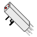

# LacAbEla's Creative Additions
LacAbEla's useful and weird additions to spice up your (my) creative worlds/server.

## Changes:
* ### Endermen won't mess up your landscapes
  When endermen try to remove a block they will pick up air instead. 
  They will also briefly catch fire as a punishment for their crimes.

* ### The GhastZooka™, a fireball launcher
  Fire! Explosions! What else do you want from me? 
  

## TODO:
* ### [WIP] Handcuffs for mobs
  Prevent those pesky mobs from getting away when they do something bad! 
  These will prevent a mob from moving. They will also force flying mobs to obey gravity.

* ### Leashable mobs
  You will now be able to attach a lead to any mob (villagers, zombies, pillagers...). 
  This will allow you to relocate them to a better place, like jail.

* ### Better fireball launcher(s)
  Add variations or configurations that improve projectile speed or power. 
  Potential Thermonuclear GhastZooka™.